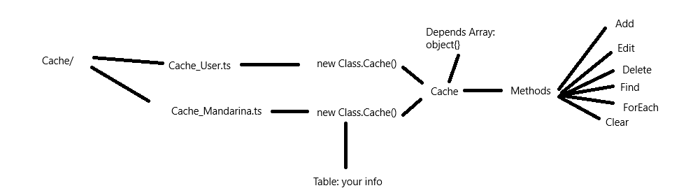

# YASK ~ Your Accessible Storage Knowledge

# Information

- 💻 Efficient and fast cache.
- 🦋 Simple and easy to use

# 🔧 Installation

```
npm i yask --save
pnpm add yask --save
yarn add yask --save
```

# Why use YASK

## 📌 Structure



> A simple structure but functional from any side you look at it.

## ⚡ Flexibility & Scalability

> This cache is flexible, non-scalable and is specifically developed for large data management and can be used in any context.

## 📦 Cache

> Its operation is based on an array that manages data within it, using methods as simple as Push, Delete, forEach and more.
## 📁 Dir & Files
> Since this is basically a cache, no type of file or directory is created, so the environment where this library is used will be much lighter and lighter.

# Methods
> Push
```ts
/**
 * @description Push an element into cache.
 * @param {String | Number | Boolean | Object} value - value
 * @param {String} reference - reference how as a key.
 * @generic {String | Number | Object | Array} T
 */

yask.Push("452", "reference1");
yask.Push([true, "io", 532], "reference2");
yask.Push({ io: 532 }, "reference3");
```
> Delete
```ts
/**
 * @description Delete an element from cache.
 * @param {String} reference - how as a key.
 */

yask.Delete('reference1') // --> true
yask.Delete('reference16') // --> false
```
> Clear
```ts
/**
 * @description Delete all of cache.
 */

yask.Clear()
```
> Find
```ts
/**
 * @param {String} reference - how as a key.
 * @description Find an element in cache, and if exist this return value.
 */

yask.Find('reference2') // --> [true, "io", 532]
yask.Find('reference4') // --> false
```
> Exist
```ts
/**
 * @param {String} reference - how as a key.
 * @description Exist or no an element of cache.
 */

yask.Find('reference2') // --> true
yask.Find('reference6') // --> false
```